# mouse_liver_TMT_reanalysis

### Dr. Phillip Wilmarth
#### Senior Staff Scientist, PSR Core, Oregon Health & Science University
#### November 21, 2025

Reanalysis of large-scale TMT mouse liver studies (2015 and 2021) from the Gygi Lab

---

## Mouse liver proteome reanalysis presentation:

---

_Slide 1_

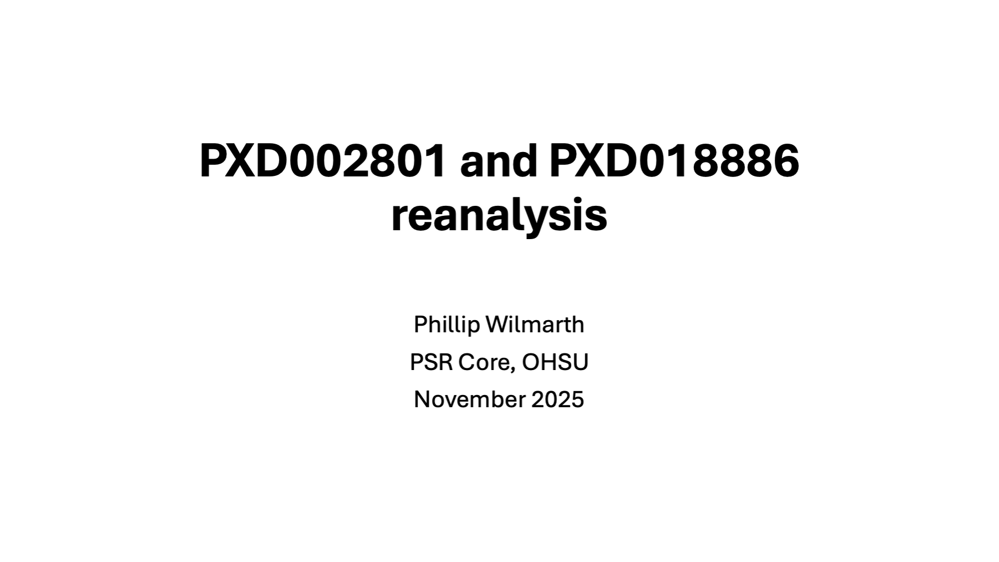

---

_Slide 2_

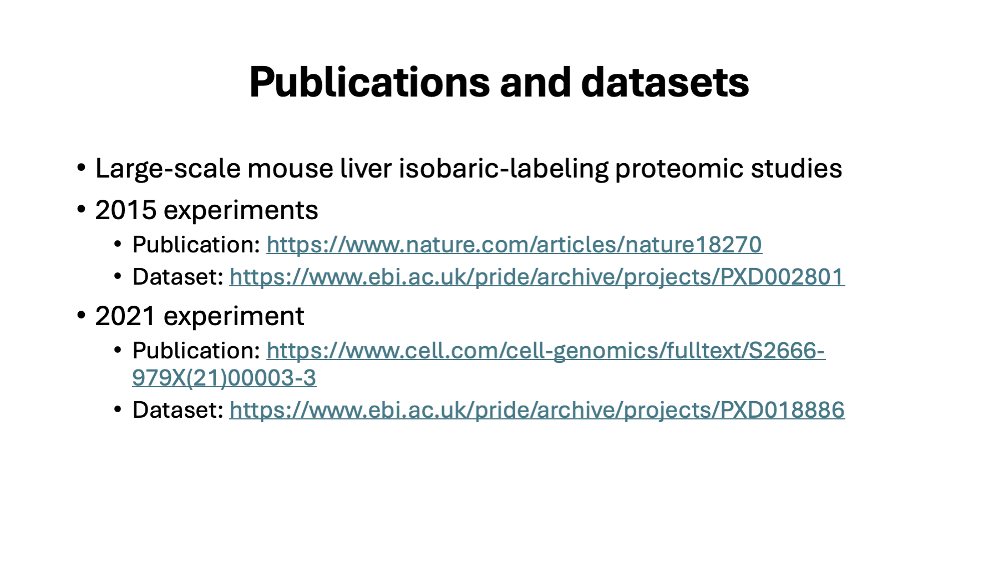

The two publications are related, with the 2021 work kind of an extension of the 2015 work. The biological questions are related to how do genomic differences in inbred and outbred mouse strains affect message relative abundance differences and ultimately relative protein abundance differences (note that abundance differences are being compared not actual abundances). Liver tissue was used for transcript and protein relative abundance measurements. The [2015 paper](https://www.nature.com/articles/nature18270) has three experiments. The data are at [PXD002801](https://www.ebi.ac.uk/pride/archive/projects/PXD002801). There is a characterization of 8 inbred founder mouse strains (these are the founder stains for both the [Diversity Outbred mouse model system](https://www.jax.org/news-and-insights/jax-blog/2020/august/jax-diversity-outbred-mice-a-genetically-diverse-mouse-for-a-diverse-human) and the [Collaborative Cross model system](https://www.jax.org/news-and-insights/2009/april/the-collaborative-cross-a-powerful-systems-genetics-tool), a very large characterization of the liver proteome from 192 Diversity Outbred mice, and a characterization of 4 Collaborative Cross inbred strains (CC 001, CC 003, CC 004, and CC 017). The [2021 publication](https://www.cell.com/cell-genomics/fulltext/S2666-979X(21)00003-3) adds deep liver proteome profiling for 58 Collaborative Cross inbred strains (a male and female mouse from each strain). The data are available at [PXD018886](https://www.ebi.ac.uk/pride/archive/projects/PXD018886).

I don’t know any genetics, so I am rather ignorant about the comparisons between the genomes, transcriptomes, and proteomes. I do know that protein abundance dynamics in proteomes are complicated to measure and understand. Steady state abundances are determined by competing rates of protein production and protein degradation. It can be very hard to measure relatively small changes in production or degradation for more abundant proteins with large pools of preexisting protein. These high abundance proteins, often from housekeeping genes, may appear to be tightly regulated because of basic logistics. Low abundance proteins have more freedom for abundance changes without wholesale cellular remodeling and may appear to have more dynamic regulation. I don’t know if that is a biological feature or just logistics. Understanding how to make system-wide measurements and interpret them probably needs much more (non-AI) effort.

The liver proteomes were of more interest to me. Tandem mass tag (TMT) 10- or 11-plex kits were used with 12-fraction LC separations to get deep proteome profiling. The TMT data was acquired using [multi-notch SPS-MS3 methods](https://pubs.acs.org/doi/pdf/10.1021/ac502040v) on Orbitrap Fusion tribrid instruments. These are quantitative proteomics data that I regularly process for clients in our University Core facility using software I wrote. The Gygi Lab has pioneered many TMT advances and comparing their analyses of these data to processing with my pipeline would be a nice way to see if different data analysis approaches can yield similar results. There are many factors that affect result specifics, so no two analyses of the same data will ever be identical. Qualitative agreement using higher level information is the only valid way to compare results.

---

_Slide 3_

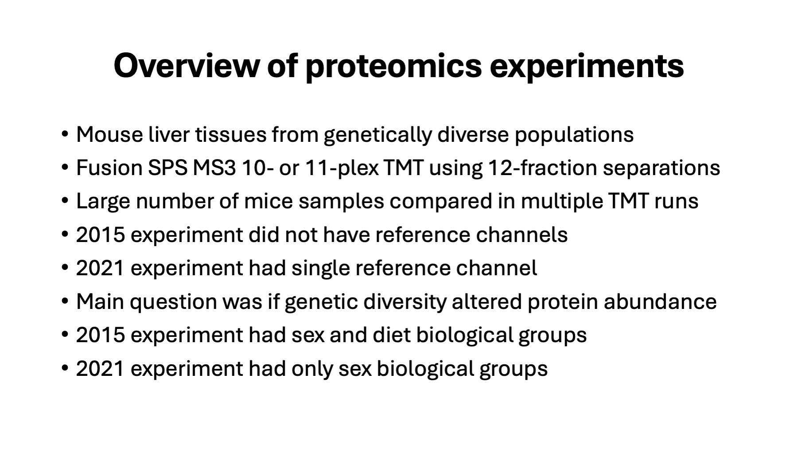

There were mouse livers from two large sets of genetically diverse mice populations. There were not really any biological replicates in those large sets; typically, one male and one female from each cross. Aside from sex, the 2015 study had low fat and high fat diets as another factor. The smaller 2015 experiments characterizing founder strains or a few of the CC strains did have some replicates (2 or 3), but low channel numbers in these 10- or 11-plex kits complicated study designs. Combining the large number of plexes required to do the large-scale studies was not addressed in the 2015 study; however, the 2021 study did have a common reference channel. Sample allocation in the studies resulted in relatively balanced samples per plex and mock reference standards created from plex-wide protein average intensities were used to combine plexes in the 2015 experiments using the [internal reference scaling method](https://github.com/pwilmart/IRS_normalization).

---

_Slide 4_

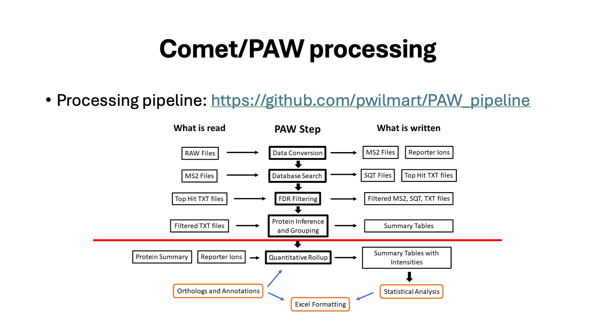

The [Comet/PAW pipeline](https://github.com/pwilmart/PAW_pipeline) developed in the [OHSU Proteomics Shared Resource](https://www.ohsu.edu/proteomics-shared-resource) was used to process the RAW files downloaded from PRIDE. Pipelines can be a series of separate processing steps or can be hidden in a one-size-fits-all black box application. Either way, there are many steps to processing bottom-up quantitative proteomics data. I have some blog posts that talk about this pipeline: a [shorter overview](https://pwilmart.github.io/blog/2020/07/12/Soup-to-nuts), more details on [design choices](https://pwilmart.github.io/blog/2021/06/06/PAW-pipeline-backstory), and how [TMT data are handled](https://github.com/pwilmart/TMT_PAW_pipeline). The next few slides discuss each step a little.

---

_Slide 5_

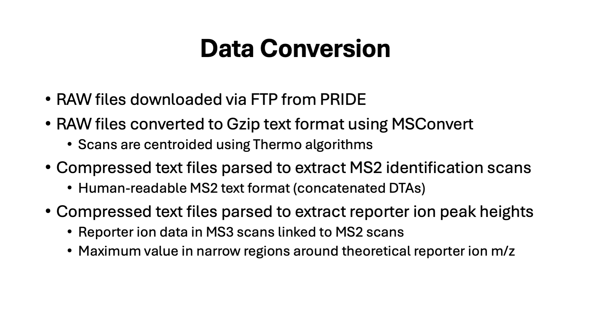

The large number of RAW files were downloaded from the two PRIDE archives [PXD002801](https://www.ebi.ac.uk/pride/archive/projects/PXD002801) and [PXD018886](https://www.ebi.ac.uk/pride/archive/projects/PXD018886). MSConvert from the [Proteowizard toolkit](https://proteowizard.sourceforge.io/) was used to convert the RAW files into compressed text format for processing by Python scripts. The compressed text files were scanned to extract the MS2 identification scans (in [MS2 format](https://analyticalsciencejournals.onlinelibrary.wiley.com/doi/pdf/10.1002/rcm.1603)). The compressed text files were also scanned to extract the TMT reporter ion peak heights from the MS3 scans associated with each MS2 identification scan. The reporter ion peak heights were saved in tab-delimited lookup files for processing by downstream pipeline steps.

There are many ways to compromise TMT data that can occur during data acquisition or during data analysis. Generating reporter ion signals in MS2 scans does not really work well enough to generate publishable results. Another common mistake is using signal-to-noise ratios as a quantitative measure of reporter ion intensity. Any ratio (PPM, signal-to-noise, fold-change) is not a unit of measurement (they are unit-less) and they are compressed numerical spaces. See my [TMT bad practices](https://pwilmart.github.io/blog/2021/12/17/TMT-bad-practices) blog for a more detailed discussion of these topics.

---

_Slide 6_

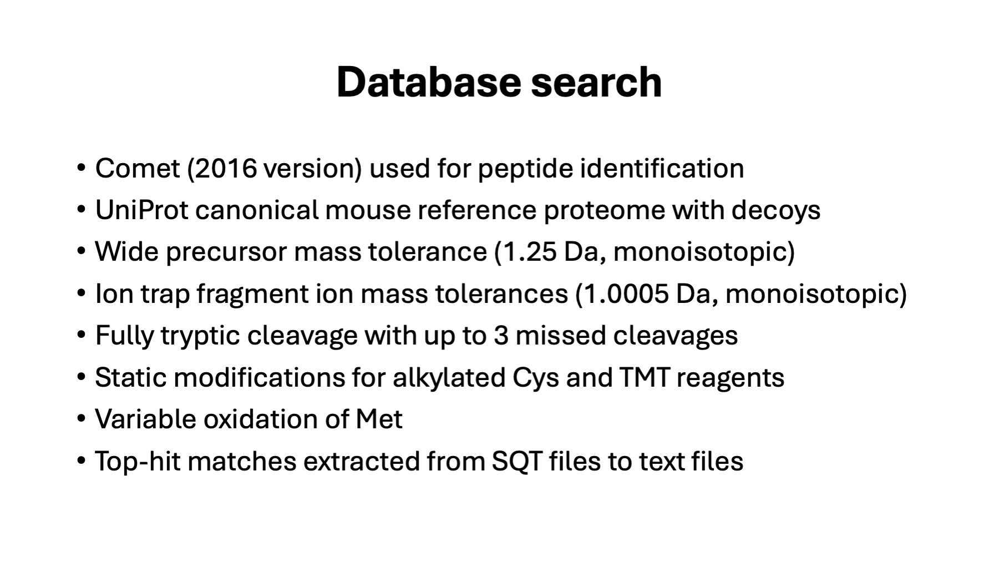

An older version of the [Comet search engine](https://uwpr.github.io/Comet/) ([publication link](https://analyticalsciencejournals.onlinelibrary.wiley.com/doi/full/10.1002/pmic.201200439)) was used for peptide identification. The FASTA file was a one protein per gene version of the [mouse reference proteome](https://www.uniprot.org/proteomes/UP000000589) from UniProt with about 22K sequences. Sequence-reversed decoys and common contaminants were concatenated using [FASTA utility scripts](https://github.com/pwilmart/fasta_utilities). A [wide precursor ion mass tolerance](https://pwilmart.github.io/blog/2021/04/22/Parent-ion-tolerance) was specified to increase discrimination between correct andd incorrect PSMs. Fragment ion parameters were the recommended Comet parameters for low resolution mass analyzers. Since these were tissue lysate samples, fully-tryptic cleavage with up to 3 missed cleavages was specified. Alkylated Cys and TMT reagent masses (Lys and peptide N-terminus) were specified using static modifications. The only variable modifications was oxidation of Met residues ([deamidation](https://github.com/pwilmart/detecting_deamidation) is taken care of by the wide precursor tolerance). The Comet results for the top-12 matches are written to SQT files that are parsed to create top-hit summary files in tab-delimited text format.

---

_Slide 7_

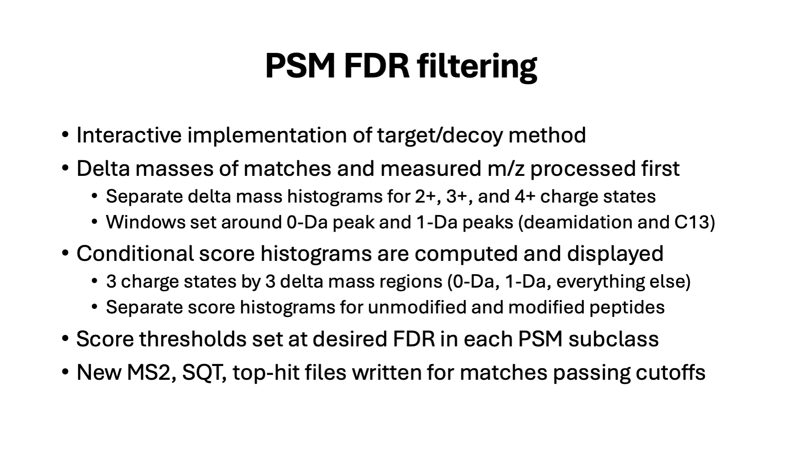

The PAW pipeline uses a meta score function of Comet scores (similar to the original [PeptideProphet linear discriminant function](https://pubs.acs.org/doi/pdf/10.1021/ac025747h)) and independent FDR control in a collection of sensible peptide subclasses to achieve PSM identification sensitivity that often exceeds what “dynamic” machine learning classifiers like [Percolator](https://www.nature.com/articles/nmeth1113) can achieve.The [target/decoy method](https://www.nature.com/articles/nmeth1019) is used to estimate the characteristics of incorrect PSMs so that they can be largely excluded. The high resolution and mass accuracy of Orbitrap instruments is used to set regions in delta mass space (the difference between the measured precursor ion mass and the calculated peptide mass) where correct target masses are concentrated. The majority of correct PSMs have delta masses in a narrow peak centered at 0.00 Da (when the instrument is well calibrated). There are smaller numbers of correct PSMs in two adjacent peaks around 1.0 Da (0.984 Da for deamidated peptides and 1.003 Da for peptides where the M1 peak was assigned the monoisotopic mass). The instruments also acquire MS2 scans on precursors without accurate masses or defined charge states when they have nothing else to do, so all other delta masses are also considered as a peptide class. Delta mass resolution depends on charge state and 2+, 3+, and 4+ peptides are processed independently.

The 3 different delta mass regions for the 3 charge states create 9 starting peptide subclasses for discriminant score analyses. Modifications complicate peptide FDR analysis and peptides are further subclassed into unmodified peptides and homogeneously modified peptides (this leads to combinatorial run away when too many [more than one or two] PTMs are specified in the search). There are cases (bio fluids) where semi-tryptic cleavage is important, so number of tryptic termini (2 is fully tryptic, 1 is semi-tryptic) can be another peptide subclass. This data with fully tryptic cleavage and one variable modification would have 18 peptide subclasses (a semi-tryptic search would have 36 subclasses). A GUI application makes it easier to set the large number of delta mass windows, and score threshold cutoffs. The PSMs that pass the FDR cutoffs are written to new (smaller) MS2, SQT, and top-hit text files.

---

_Slide 8_

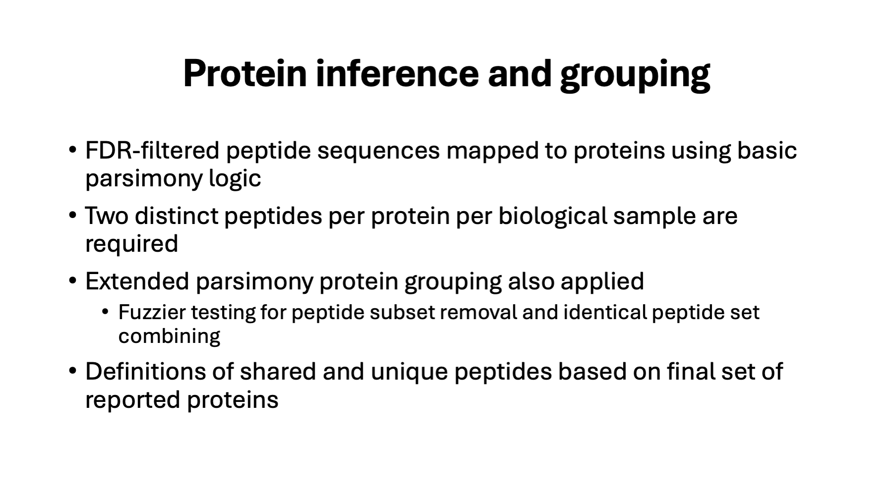

Once an accurate set of peptide sequences have been filtered from the full dataset, the peptide sequences are mapped to proteins in the FASTA file using basic parsimony rules (proteins with identical peptide sets are reported as single protein groups; proteins with peptide sets that are subsets of proteins with larger peptide sets are not reported). The initial protein inference is done experiment-wide. The first pass protein filtering requires two distinct peptide sequence strings per protein (removal of one-hit wonders). Then a stricter protein filtering requiring two distinct peptides per protein per “biological sample” is invoked. Fractionated samples are considered single samples (all fractions combined). TMT labeling is a hidden dimension during protein inference, so any TMT labeled data (single shot or fractionated) has the entire TMT plex behaving like one effective “biological sample”.

Basic parsimony logic falls short for modern datasets which can be very large. An extended parsimony logic protein grouping step is used for peptide sets that combines proteins that have mostly the same peptide sets into protein families (and removes proteins that have peptides that are mostly subsets of other protein peptide sets). Definitions of shared peptides (mapping to more than one protein sequence) or unique peptides (mapped to a single protein) are initially determined from all proteins in the FASTA file. As proteins get grouped and removed during parsimony analysis and tested for at least two peptides per protein per sample, a smaller list of reported proteins is generated. Shared and unique peptide status is recomputed using the smaller list of reported proteins rather than the full FASTA file. Another collapsing of the reported proteins occurs after extended parsimony analysis  and shared/unique peptide status is recomputed using the final list of reported protein identifications.

---

_Slide 9_

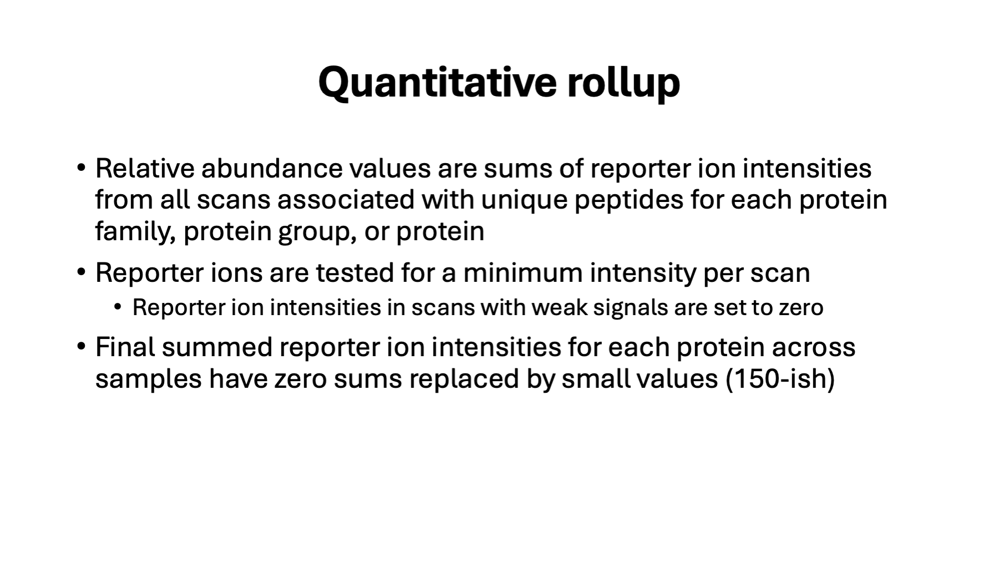

There are many choices for data summarization in quantitative proteomics experiments. The poorest choices are any that involve ratios. Pie charts would be better than that. How about a biologically meaningful scale where highly abundant proteins have large values and low abundance proteins have small values. Maybe a scale that has a more linear dependence between abundance and measurement scale. People’s brains do not have much intuition for numerical scales that are non-linear (ratios, logarithms, constrained systems, etc.). The PAW pipeline uses the sum of all reporter ion intensities (a poor man’s intensity-weighted average) from all scans associated with each protein. There are several steps in this intensity rollup. The reporter ion intensities come from individual instrument MS3 quantitative scans where a confident (passing an FDR cutoff) peptide sequence could be assigned to the linked MS2 identification scan. Scan can and will be redundant with more than one scan mapping to the same peptide sequence. The peptide sequences have a known (more accurately an inferred) relationship to protein sequences (taking I/L ambiguity into consideration). When a peptide maps to more than one protein, we do not know what the associated reporter ion intensity means with respect to the relative abundance of each protein that it maps to. We have to exclude any such “shared” peptides. It is critical to define shared or unique peptides in the context of the final list of inferred proteins or considerable quantitative information will be lost. Different FASTA file choices for a given species can range from little peptide redundancy to very high levels of peptide redundancy (peptides mapping to multiple similar protein sequences). If only unique peptides in the context of a highly redundant “completer” FASTA file were used, the majority of the reporter ion measurements would be discarded. This leads to poor quantitative data quality.

Orbitrap instruments will measure reporter ion peak heights okay until the intensity gets close to the noise level. Thermo instruments subtract a transient signal noise level before Fourier transforming to m/z and intensity values. As reporter ions get near the noise level, you sometimes have a peak height and many times you have nothing. The noise level can be determined by seeing what are the smallest non-zero peak heights in each channel. Those values are typically 300-400 on our Fusion instrument with 50K resolution. The peaks are a little taller on our Eclipse where 500-600 seems like the noise level. A trimmed average intensity is computed for the reporter ions peak heights per scan and tested against an appropriate minimal threshold (500 on the Fusion and 750 on the Eclipse). If the trimmed average does not exceed the threshold, all reporter ion peak heights are set to zero for that scan. Adding zeros to a sum does not change the sum, but the peptide that the scan maps to is still used for protein inference.

The number of missing values decreases as data is aggregated. There are fewer missing values for peptides than for individual scans. There are fewer missing values for proteins than there are for peptides, especially when two peptides per protein are required. The missing value problem is minimal after aggregation to proteins. Proteins that have any reporter ion channels that still are zero have those zeros replaced by a small sentinel value (150 or 200). This eliminates zero division errors in any downstream steps, has little effect on the statistical testing, and allows missing values to still be recognizable.

---

_Slide 10_

We see that a single plex TMT experiment involves a tremendous amount of effort: forming an interesting biological question, designing an experiment to address that question, finding/creating the biological replicates, biological sample collection from biological subjects, sample processing steps, protein digestion, peptide labeling, numerous protein and peptide assays, sample fractionation, instrument choices, method choices for operating instruments and acquiring data, instrument calibration, instrument suitability testing, data collection, data checking, data analysis, data summarization, statistical testing, results summarizations, results interpretation, follow-up experiments using other methods, combining results from numerous experiments, crafting a coherent scientific story, writing up results, submitting a paper, and (hopefully) making a contribution to the scientific record.

We need some basic understanding of how things are measured in a single plex TMT experiment before discussing how to combine multiple plexes. The main concept in isobaric labeling is that TMT reporter ions are a snap-shot relative biological sample protein abundance measurement. There is a tendency in proteomics data for analyte ion current (think precursor area under a curve or a precursor peak height) to be proportional to analyte abundance. Tryptic digests are complicated samples, so this is not a simple MS assay situation. There are matrix effects where sample complexity affects ion currents. Enzymes that cut proteins may not make equal molar numbers of all possible peptides. Liberated peptides may be differentially lost to surfaces and in LC systems. Peptides may form ions at different relative “efficiencies”. The set of peptides produced from a trypsin digest of a protein should (ideally) all be equal molar at whatever relative abundance the protein was. That should translate to equal intensities from all peptides. That never happens and complicates relative protein abundance measurements. Measuring absolute protein concentrations in tryptic digest will be an evergreen impossibility for proteomics.

As confusing as the previous paragraph may have been, TMT measurements are something else altogether. The reporter ions that label all the biological samples are measured simultaneously in a single scan. That basically means that the relative abundance of the biological samples is captured in the relative intensity pattern of the reporter ions. The reporter ions in a single scan do indeed have individual intensities (peak heights) for each biological sample, but those intensities values have little inherent physical meaning. They depend upon when the snap-shot MS2/MS3 scan was taken of the eluting peptide. The reporter ions will be most intense if the scans happen near the peak apex or they could be much less intense if the scans occur at the base of the eluting peptide peak (near the baseline noise level). The pattern of the relative abundance of the biological samples is expected to be independent of when the eluting peptide was sampled. So, any MS2/MS3 scan of an eluting peptide ion produces essentially the same information (pattern) independent of the absolute magnitude of the reporter ion measurements. Since the biological pattern of reporter ions are independent of sampling, summing scans of the same peptide preserves the biological pattern (but improves data quality). Since peptides that map to the same protein have to preserve the information of that protein, the reporter ions from individual scans can be summed all the way up to proteins and still preserve the relative biological abundance patterns. This is what is going on when the PAW pipeline summarizes the reporter ion intensities into protein intensities.

---

_Slide 11_

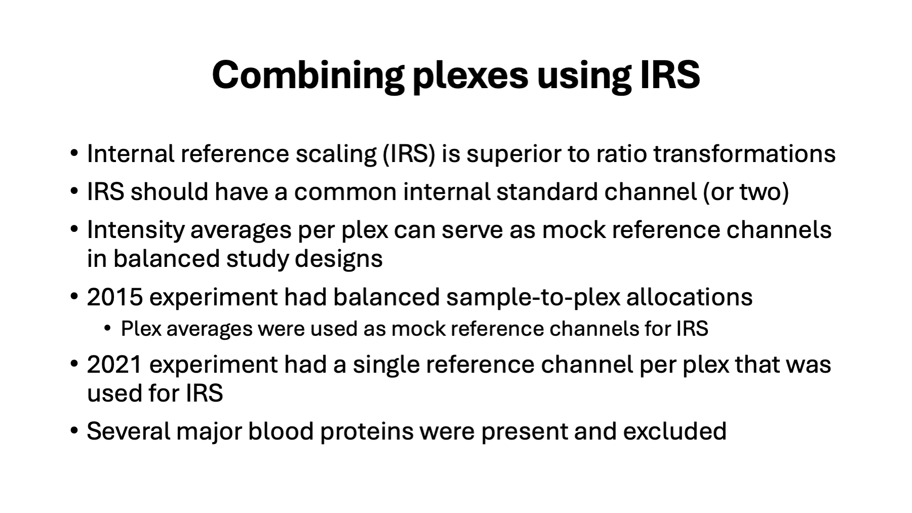

What if the experiment had more samples than TMT channels? Can you use more than one TMT-labeling kit in a single larger experiment? Yes, you can. The summation of somewhat arbitrary reporter ion intensities into biological sample relative abundance patterns happens independently in each TMT plex in a multi-plex TMT experiment. Each TMT plex defines its own local arbitrary intensity scale. To compare biological samples across plexes, all plexes need to have the local intensity scales matched to a common scale. We solve this problem by working backwards. If we combined some peptide digest from each sample in the larger experiment into a common reference (master) mixture, we could take aliquots of that mixture, label them with appropriate TMT tags and include them in each individual plex of a multi-plex experiment. The reference mixture has all the digested peptides from all the proteins in the experimental samples and in similar relative protein abundances. It is like a reference meter stick for measuring lengths that is present in each TMT plex that gets distorted by how the instrument selects MS2/MS3 scans. This distortion is like viewing the meter stick through different fun house mirrors (a different mirror for each plex). Because we know what the original meter stick should look like, we can correct the distorted image to get proper measurements. The reference standard actually provides a different meter stick for each individual protein.

The recommended way to apply the internal reference scaling method, is to use two duplicate channels (technical replicates) of the reference mixture in each plex so that average intensities of the two channels will provide better quality scaling factors. The average reference channel intensity of each protein is computed per plex. For a given protein, those averages are averaged over all plexes to estimate a ”true” intensity level for that protein. The measured average reference intensity in each plex is compared to the “true” value to determine factors to scale the measurement of that protein in each plex to the “true” value. That scaling factor, computed only using the reference channels, is applies to all reporter ion intensities for that protein in that plex. Bringing all reference channel intensities in each plex to a common “true” scale also brings all biological sample protein intensities onto the same common intensity scale. This magically makes several smaller TMT kits behave like one very large TMT kit. The caveat is that scaling factors can only be computed for reference channel proteins observed in all TMT plexes.

The 2015 experiments did not have any reference channels but randomized sample to plex assignments were done to create balanced plexes with 10 samples each. The average intensity of each protein in each plex can function of a reasonable mock reference channel given the balanced study design. That approach was used to combine the multiple plexes from the three experiments (3 for founder strains, 4 for CC strain characterization, and 21 for the large Diversity Outbred experiment). The 2021 experiment had one reference channel in each of the 12 plexes and that reference channel was used for IRS. Contaminant proteins almost always depend on the particular experiment and several major blood proteins were present in the mouse livers and were excluded from quantitative analysis.

---

_Slide 12_

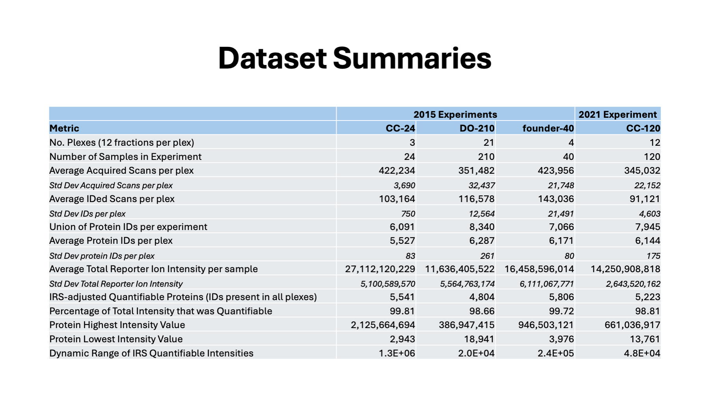

There are many basic metrics to track in large-scale TMT experiments. There are study design characterizations. How many samples? How many plexes? How many channels per plex? There are the bottom-up dataset metrics. How many MS2 scans were acquired per plex? Per experiment? In the 2015 experiments, there are 1.27 million MS2/MS3 scans acquired for the characterization of 4 CC strains. The ID rate was 24% (309K identified scans at 1% PSM FDR). The DO experiment had 7.38 million MS2/MS3 scans and an ID rate of 33% (2.49 million identified scans). The characterization of the founder strains had 1.70 million MS2/MS3 scans and an ID rate of 34% (572K identified scans). The 2021 120 CC liver study had 4.14 million MS2/MS3 scans and an ID rate of 26% (1.09 million identified scans). There were 14.49 million MS2/MS3 scans acquired in total from the 4 experiments. Reporting numbers of acquired scans and the number of scans assigned PSMs at a defined FDR are useful numbers to report to assess instrument performance and data processing efficiency.

Extended data figure 1 from the 2015 paper has some identification numbers for PSMs and proteins for the founder strain experiment. The original publication used SEQUEST and an in-house pipeline to identify 408K PSMs compared to 572K in the PAW reanalysis. The reanalysis used a FASTA file with fewer distinct peptides (UniProt canonical reference versus Ensembl) and used the more rigorous two distinct peptides per protein identification criterion. The reanalysis had just over 7K protein IDs and the publication reported 7700 proteins. The reanalysis was more sensitive and shows that reporting PSM numbers is a much better performance metric than are protein identification numbers.

Reporting protein identifications is a particularly bad practice for primary metrics. The numbers of PSM scans are almost assumption free. The protein numbers depend on a multitude of assumptions (many of which are quite poor) and are highly variable. This is a number that is particularly easy for marketing departments to cook to their advantage. How proteins are discussed and counted in quantitative experiments is especially bad. The common (bad) practice is to report the union of all protein IDs across the entire dataset in an experiment. The number of proteins per sample always have some incorrect noise matches. The number of noise matches increases linearly with the number of samples, so the union of protein identifications in experiments with large number of samples becomes a very problematic metric. The average number of identifications per “sample” (I will explain the quotes soon) is a more meaningful number. Note that the DO experiment with 21 plexes (TMT channels are hidden, so plexes become equivalent to biological samples in TMT experiments for this discussion), has a difference of over 2000 proteins between the union of IDs and the average number of IDs. The average number of IDs per sample is an upper limit to the number of quantifiable proteins in an experiment because quantification requires better data than basic identification. The number of quantifiable proteins will always be smaller than the number of identifiable proteins.

The intensities of reporter ions depends on instrument performance and there can be much more variation in intensities across experiments than the variations seen in the number of identifications. Scans just above the noise level can result in identifications but not be of sufficient quality for quantitation and contribute little to the total reporter ion intensity per sample.

There are some misconceptions about the practical penalty of the IRS method being restricted to the proteins common to all plexes in a multi-plex experiment. This is why protein counting conventions are so problematic for understanding quantitative experiments. If we compare the average protein IDs per plex (row 8) to the number of proteins that we can quantify after IRS (row 12), we see that for modest number of plexes being combined (the CC-24 and founder-40 columns) the number of quantifiable proteins is actually very good. Even when we go to much large experiments (DO-210 and CC-120), we do not lose many quantifiable proteins compared to the average ID numbers. Protein counting is always highly biased towards low abundance proteins. Those proteins contribute little to the total proteome (although they could be of biological interest). Row 13 show the fraction of the proteome that the IRS-quantifiable proteins represent (total intensity of the IRS-quantifiable proteins out of the total proteome intensity). The very large experiment only lose about 1% more of the proteome compared to the smaller experiments (but still almost 99% of the total proteome).

---

_Slide 13_

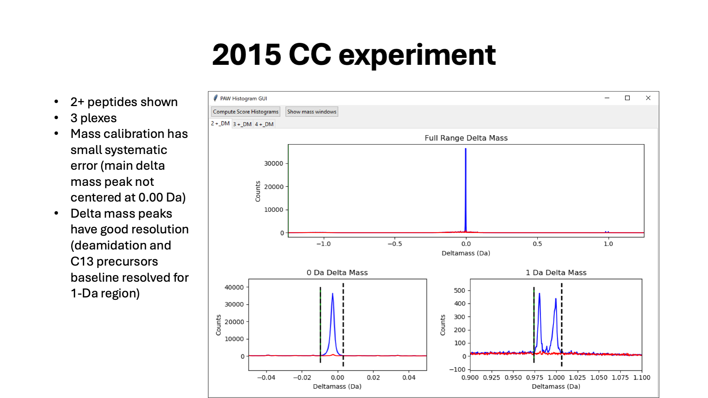

Now that we have an overview of the data analysis concepts, we can look at some data quality control visualizations. These plots are the delta masses for 2+ peptides for the CC-24 experiment from the 2015 paper. Mass resolution is excellent although the 0-Da peak is not centered at 0.00 Da. 3+ peptides look similar but with slightly less good resolution. There are typically not a very large fraction of 4+ peptides in good tryptic digestions. The data for 4+ peptides looks similar but gets noisier.

---

_Slide 14_

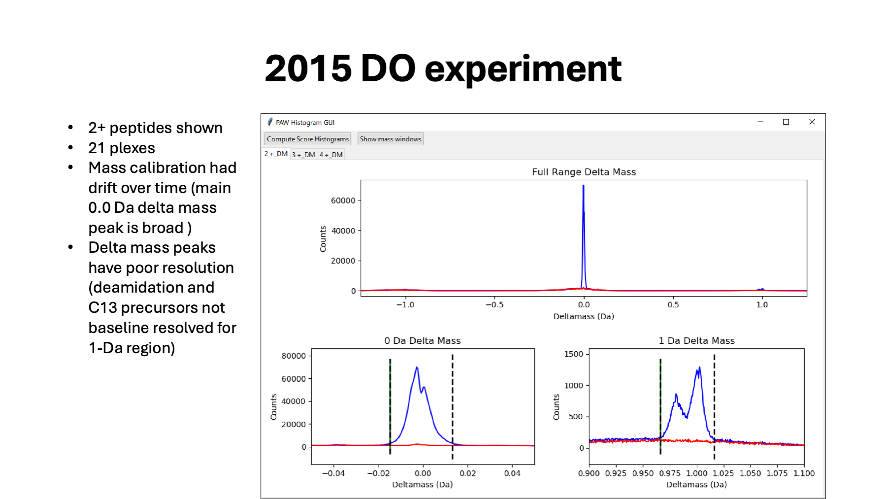

These are the 2+ peptide delta mass plots for the large DO-210 experiment from the 2015 paper. Given that 21 12-fraction plexes with 2-hour LC runs would take weeks to complete, some mass calibration issues are not unexpected. The PAW pipeline does wide precursor tolerance searches, so data like this works fine. If you are a fan of the lazy practice of narrow precursor mass tolerances and useless percentage-based delta mass scales (PPM), then the mass errors might be an issue that needs to be checked.

---

_Slide 15_

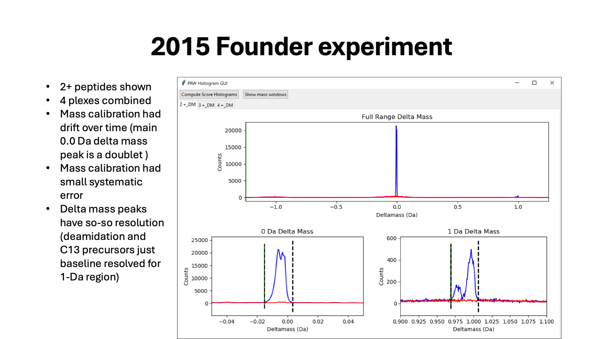

The founder-40 experiment also had some minor delta mass issues. The resolution is a bit worse (the 0-Da region looks like two peaks) and the 0-Da peak is not centered at 0.00 Da.

---

_Slide 16_

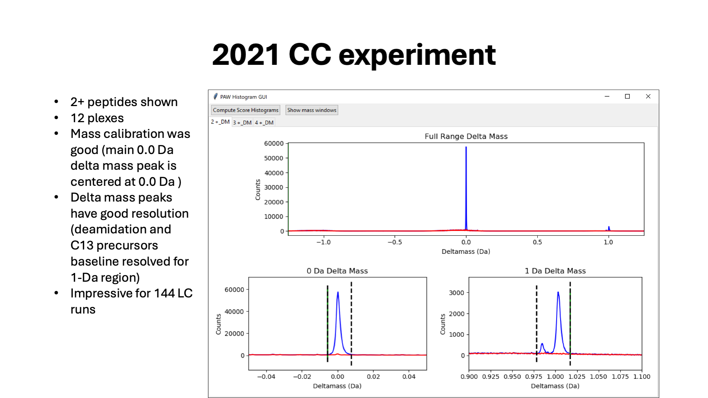

The instrument calibration was very good in the 2021 experiment. Delta mass peaks for 2+ peptides are narrow and centered at correct masses.

---

_Slide 17_

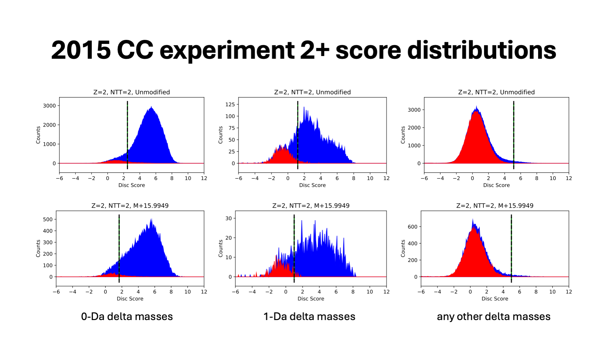

There are a lot of delta mass and score histograms associated with processing the 4 TMT experiments. The data from all plexes for each of the two large experiments could be processed together without any problems on a Windows 10 single computer (Parallels virtual machine that is about half of my iMac Pro [5 of 10 cores and 32 GB of 128 GB RAM]). Processing all data took a few days with file conversions being the bottleneck. The total amount of disk used at the end of the analysis was about 600 GB. Simple desktop computer power has increased much more quickly than datasets have increased in size, even for a very large experiments like this. I do not see any need for the cloud, clusters, or indexed fragment ions.

Shown here are the score distributions for 2+ PSMs from the 2015 CC strain experiment (3 plexes, 24 samples). Matches to the target half of the FASTA file the blue score histograms and matches to the decoy half are the red score histograms. The dotted lines are the 1% PSM FDR cutoffs. The location of the score cutoffs depend on the numbers of target and decoy matches in each peptide subclass (the shapes of the score distributions do not change much by peptide subclass) and are different for each peptide subclass. This is how the PAW pipeline FDR analysis adapts to each dataset without the need for any complicated dynamic classifier computation step. The same static linear discriminant classifier function has been used on hundreds of datasets over the past 18 years without any changes. Most of the Python scripts were written in 2014 and the Comet version used is from 2016. The actual proteomics concepts have not changed in the past 18 years despite what marketing departments and high impact journal article say.

---

_Slide 18_

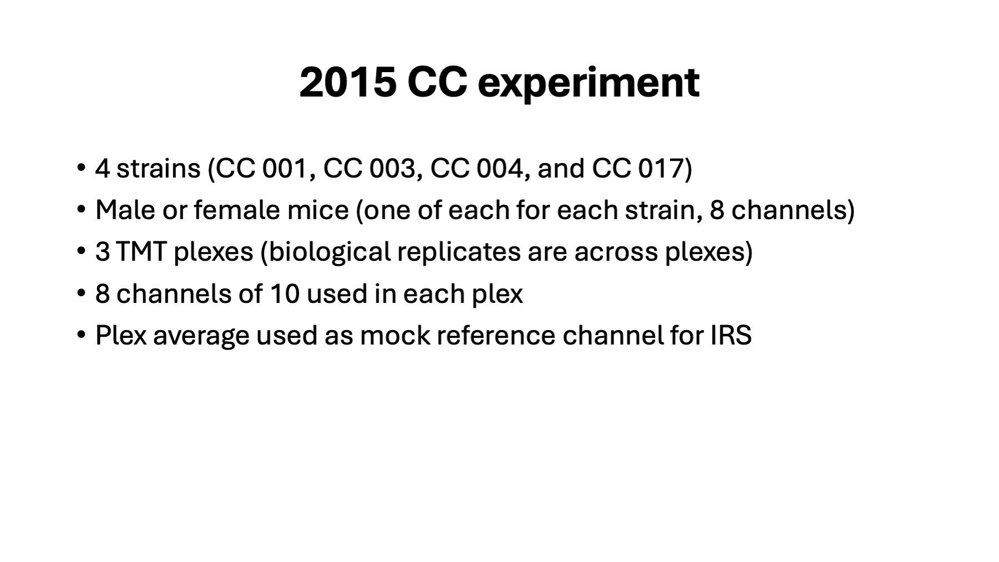

This is an overview of the 2015 characterization of 4 CC strains (24 samples in 3 plexes). There are no figures in the 2015 paper for this experiment.

---

_Slide 19_

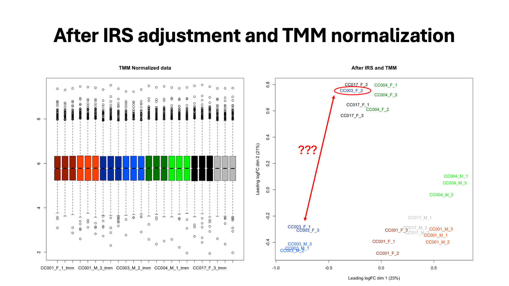

On the left are protein total TMT intensity distribution boxplots with samples color coded. Each of the 4 strains are different color families (red, blue, green, black/grey) with 3 female mice in the darker color and 3 male mice in the lighter color for each strain. The boxplots are in excellent horizontal alignment after IRS adjustment and the trimmed mean of M-values (TMM) normalization function in the edgeR Bioconductor package. The multi-dimensional scaling plot (like a PCA plot) on the right shows that the samples cluster by strain and by sex (roughly equal strengths). The IRS approach has removed any TMT plex batch-like effect from the data. Interestingly, one CC 003 female sample clusters with the CC 017 female samples (a mis-classified mouse?). This is a clear deviation from the pattern of all other samples. There was no statistical work up of the proteome differences between strains or between sexes in the publication, so further analysis of this data was not done in the reanalysis.

---

_Slide 20_

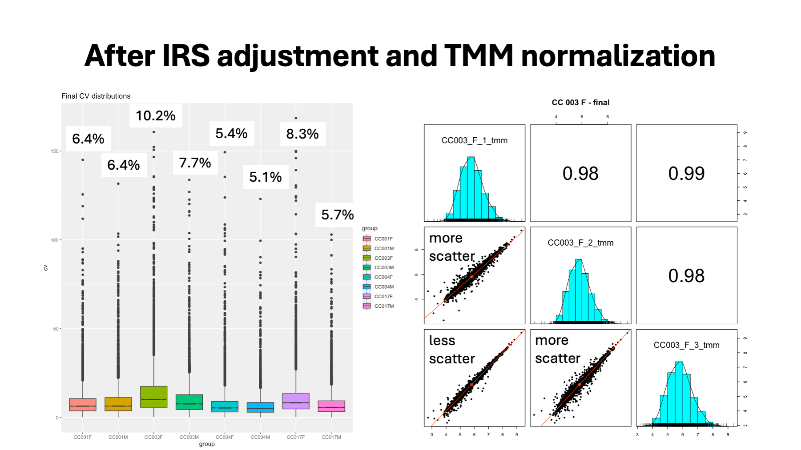

Here are some more QC checks for the 2015 CC experiment. The distributions of protein coefficient of variation values are shown on the left. The median CV values are listed above the respective distributions. The CC 003 female samples have larger CVs (as do the CC 017 female mice). A scatter plot grid figure for the CC 003 female samples is shown on the right. The CC003_F_2 sample (from the second plex) is less similar to other samples in the group compared to the similarity of the two CC003 female samples from plexes 1 and 3.

---

_Slide 21_

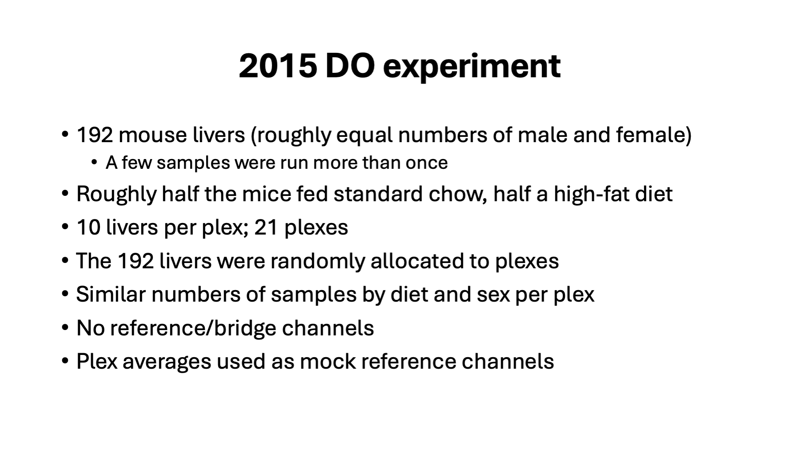

Here are the key points about the Diversity Outbred experiment from the 2015 paper. Again, no reference channel but mostly balanced sample allocation per plex (similar numbers of each diet in each plex and similar numbers of each sex in each plex. DO strains randomly allocated.

---

_Slide 22_

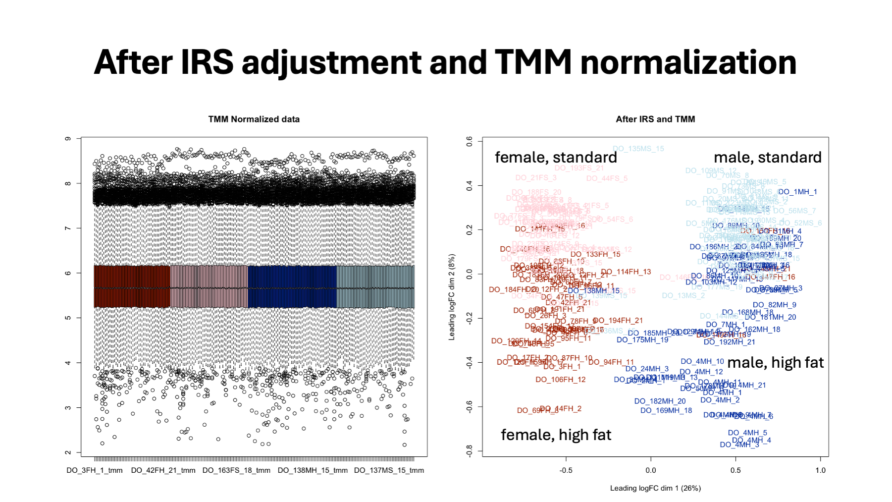

The 210 samples make for a complicated boxplot of protein intensity distributions (left). Females are in dark red (high-fat diet) or pink (standard chow) and males are in dark blue (high fat) or light blue (standard chow). Note that boxplots are horizontally aligned because of TMM normalization. Boxplot look very similar with or without doing the IRS adjustment (but the data is pure crap without the IRS adjustment). The MDS plot on the right shows that females and males separate left-to-right and that diet separates top-to-bottom. The x-axis strength is about 3 times larger than the y-axis suggesting that sex is a much bigger difference than diet. Extended data figure 2 in the 2015 paper has a similar looking PCA plot (A). Seven of the 8 individual proteins shown in (B-E) were present in the final IRS-adjusted data (the other protein was not seen in all 21 plexes). Plots of those proteins were made in an Excel results file tab and they are qualitatively similar in all 7 cases. The results from the 2015 study can be replicated in a very different reanalysis effort (different FASTA, different search engine, different data filtering, different protein inference, and VERY different treatment of reporter ions).

---

_Slide 23_

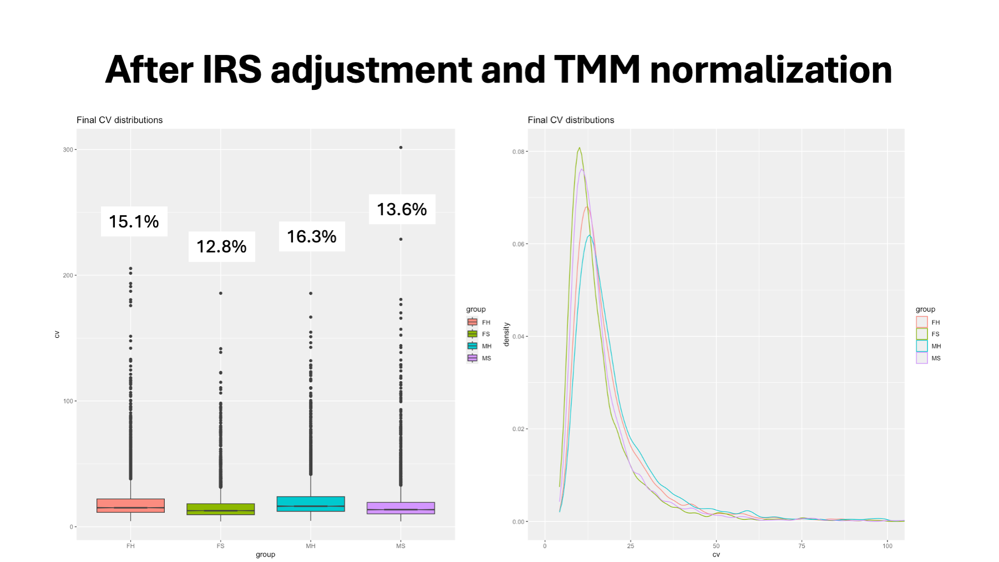

Boxplots of the CVs are shown on the left with the median CV values listed above the groups. The distribution density plots are shown on the right where all 4 groups have similar shaped distributions. These CVs are considerably large than we had for the CC strain experiment.

---

_Slide 24_

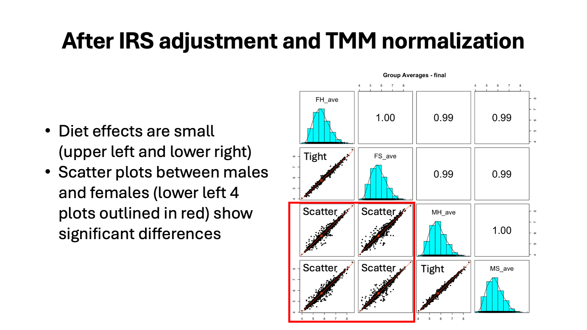

This scatter plot grid shows the 4 biological group average protein intensities against each other. FH is high fat diet female, FS is standard chow female, MH is high fat male, and MS is standard chow male. It is easy to see that the sex difference is much larger than the diet difference. The way reporter ion intensities are summed into protein totals and kept in a natural, linear intensity scale in the PAW pipeline facilitates proteome comparisons and insights. The protein intensities will not be perfect proxies for protein relative abundances, but they are good approximations. In dozens of projects where basic features of the proteomes under study are known from many previous studies, these summed reporter ion protein intensities reflect the known biology. We have protein intensity sums that span 5 decades of intensities. Liver has some prominent high abundance proteins (these are log10 plots) and the proteins that are different between females and males are medium to lower abundance proteins. This proteome-level summarization can be very useful to biological interpretation of the data.

---

_Slide 25_

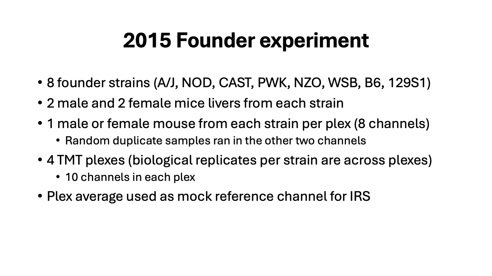

Here are the details of the founder strain characterization experiment from the 2015 paper. There are 32 biological samples in a 4-plex, 40 channel experiment. Some of the samples were duplicated to fill up all 40 channels (5 samples from each founder strain). The plex-wide average intensities were used as mock reference channels.

---

_Slide 26_

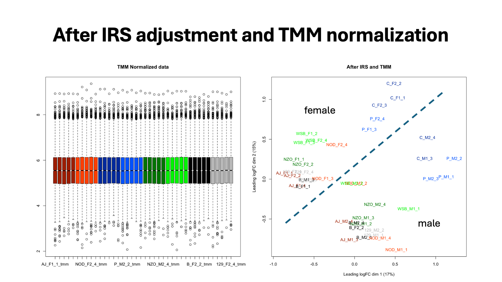

The lovely protein reporter ion intensity boxplots are shown on the left. The colors are for the 8 founder strains. The female and male mice samples are the same color. The MDS plot on the right is a little messy because the 8 strains separate from each other and each strain has the female and male samples separating from each other. The dotted line separates female from male samples again suggesting a strong sex effect. The CAST (C) and PWK (P) strains are more separated from the other 6 strains. This agrees with the PCA plot in Extended data figure 1 (B) from the 2015 paper. The individual proteins in (D) were also checked and trends were also in good agreement (the 4th figure and the last figure are labeled with the same gene symbol (the last plot label seems to be wrong and the gene being plotted is not known).

---

_Slide 27_

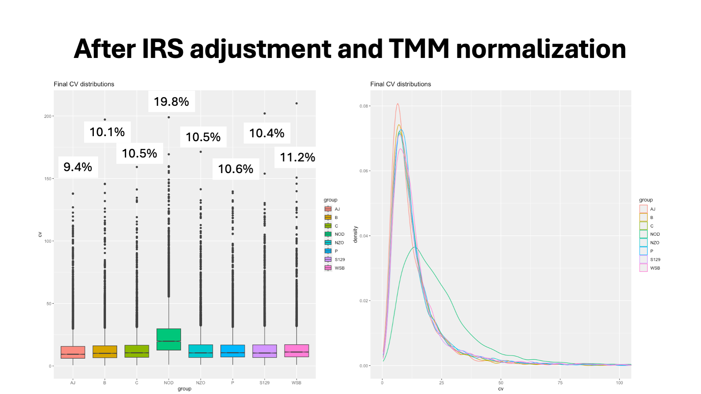

Boxplots of the CVs are shown on the left with the median CV values listed above the groups. The distribution density plots are shown on the right where all 7 strains have similar shaped distributions, and the NOD strain has a rather different shaped distribution. These CVs are intermediate (larger than the CC experiment and smaller than the DO experiment). That is likely from including both female and male samples in the strain groups. This founder strain characterization needs more replicates to do much more analysis with. If mice were separated by sex, there would 16 groups with just two biological replicates per group.

---

_Slide 28_

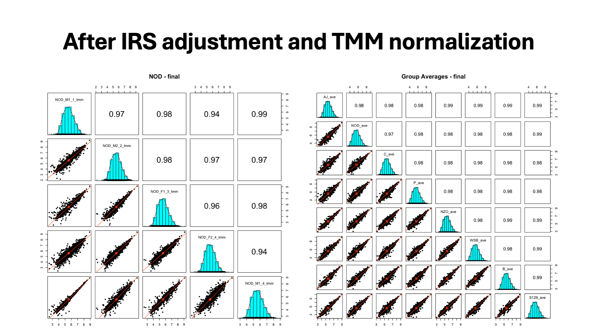

The scatter plot grid for the NOD strain is shown on the left. The samples all show differences from each other. All scatter plots except for the lower left plot have significant scatter. The lower left plot is the duplicated sample (male 1 from the first and 4th plexes). The IRS adjustment has removed the instrument random sampling effect and only some low abundance proteins show deviation from the diagonal trend line. The right shows the intensity averages from each of the 8 strains versus each other. We do see a range of how much scatter there are in the plots demonstrating that the strains do have significant differences.

---

_Slide 29_

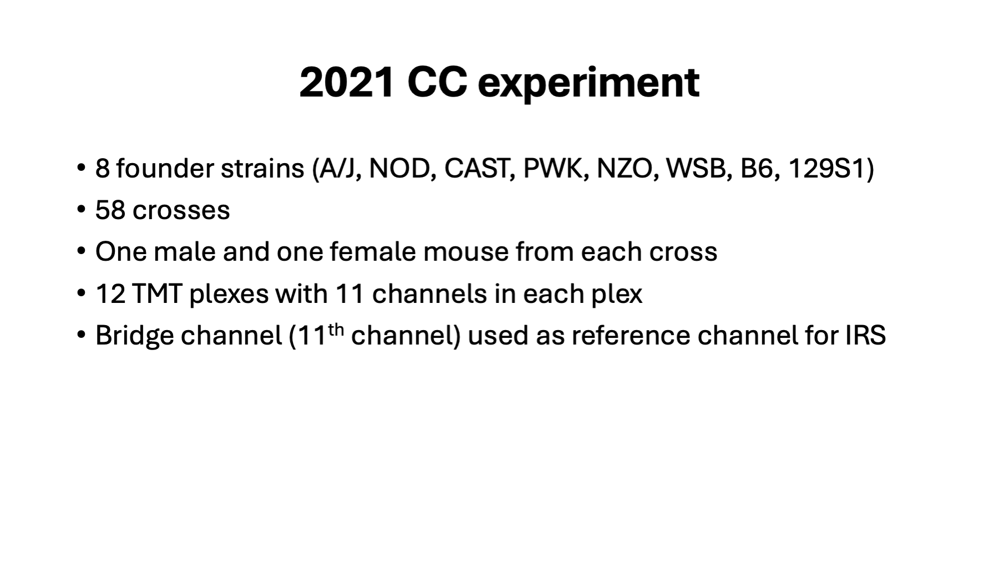

Here are the details of the 2021 CC experiment with 120 mouse livers from 58 CC crosses (one female and one male mouse from each cross). There were 12 11-channel plexes. The 11th channel in each plex was a common reference channel and that was used in the IRS adjustment.

---

_Slide 30_

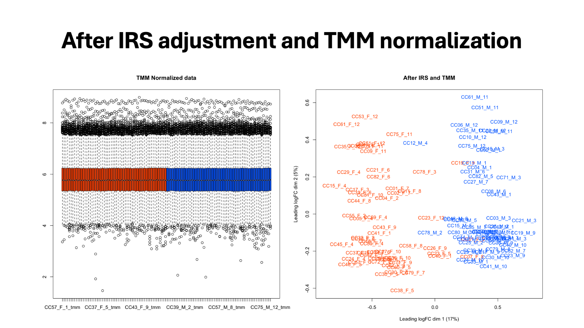

The boxplots of the intensity distributions of the protein reporter ion sums are shown on the left (females in red and males in blue). The MDS plot shows that the samples separate strongly by sex.

---

_Slide 31_

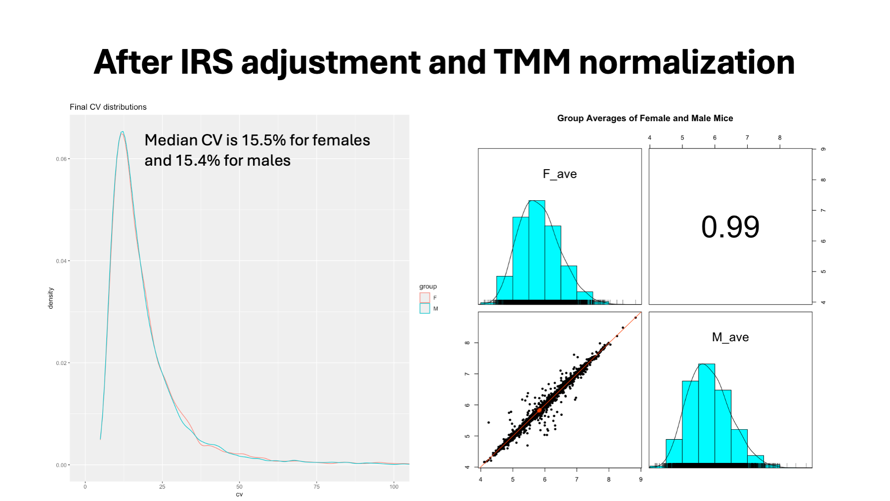

The CV distributions are similar to what we saw in the DO experiment from the 2015 paper (median CVs values around 15%). There was no subgrouping by diet in the 2021 experiment. The scatter plot grid shows the scatter plot of the average female protein intensities versus the average male intensities. There are a relatively small number of proteins having significant intensity differences.

---

_Slide 32_

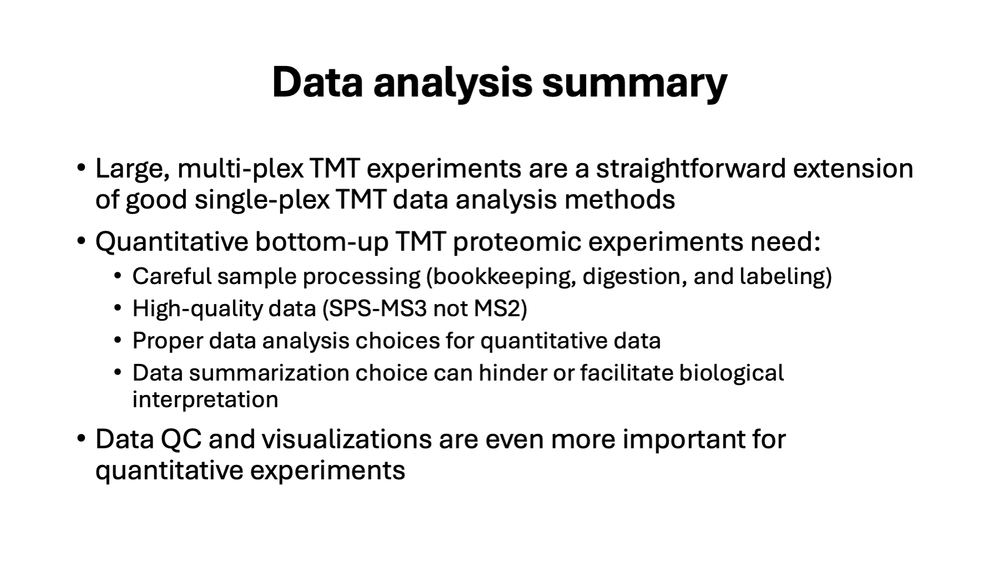

Large-scale single-plex TMT experiments take some time and effort to analyze well. There is some extra time and effort required to process multi-plex TMT experiments. With a good experimental design implementation of the IRS technique, the final combined data will be as high quality as single plex data (slightly reduced proteome profiling depth is the only tradeoff). Not all processing pipelines are equivalent even if they claim to support TMT experiments. Proteome Discoverer has many default settings that are not good choices and the need to define the experiment ahead of time makes the set up extremely tedious. Data needs to be exported to complete proper statistical testing and do QC checks. The PD export table formats are dependent on the specific workflows used and that can complicate importing into other data analysis tools. MaxQuant is (maybe) easier to set up than PD, but the PSM identification sensitivity is shockingly poor, and the software can be slow and prone to crashes. Since MQ is designed to be used with Perseus, the output tables are sort of formatted to facilitate downstream data analysis with other tools. The MQ summary tables are not as easy to import into R or pandas as one might hope. The PAW pipeline is the only pipeline I am aware of that includes support for IRS multi-plex experiments and summarizes the reporter ion data in a nice, biologically accessible format.

I use Jupyter notebooks, R, and Bioconductor packages for QC and statistical testing (none of that was done for this data, however). Yes, there are many more data analysis steps needed to get data to the publication stage than were mentioned in this presentation. Note that those additional steps have nothing to do with TMT labeling. QC checking, statistical analyses, final data formatting, enrichment analyses, and biological interpretation all must be done for any quantitative proteomics work. There are many issues that can (and do) happen in these larger experiments, such as, bad samples (outliers), mis-labeled samples, poor LC or MS performance, and contaminating proteomes (blood proteins were a minor issue in these liver samples). You really want to discoverer these issues and correct things before writing the paper. Reporting differentially abundant immunoglobulins in liver tissue would not help your scientific reputation.

---

_Slide 33_

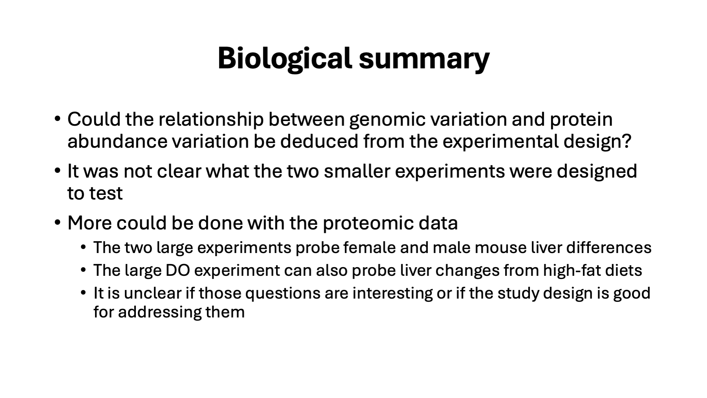

I don’t know enough genomics to understand exactly what these two papers were designed to show. It seems to me that there is a huge amount of biology in between transcript relative abundance differences and the static levels of proteins in liver tissue. I do not know how to connect those dots. I was also unsure what the two smaller experiments in the 2015 paper showed. I suspect the different inbred strains of mice have many known differences besides differences in liver proteomes. The two large scale DO and CC experiments do provide mouse liver proteome data from a more biologically diverse cohort than you would get from single strain studies. The difference between female and male mouse liver proteomes is quite pronounced. Maybe this is already well-studied? The large DO experiment has low-fat and high-fat diet changes that could be explored and if those changes are similar for female and male mice. Again, maybe this is already known. Or maybe cancer in mice is a bigger health risk that are diet and lifestyle choices. I do not know what the NIH long term goals are for improving the health and quality of life for lab mice.

---
